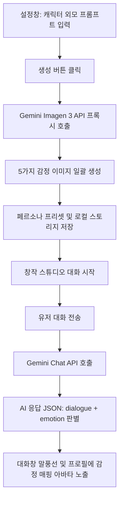

# 캐릭터 이미지 생성 및 감정 맵핑 시스템 구현 기록 (2026-06-04)

설정창에서 캐릭터의 외모 프롬프트를 바탕으로 이미지를 생성하고, 대화 응답의 감정 상태(emotion)에 따라 동적으로 이미지를 매핑하여 대화창과 프로필에 노출하는 시스템을 구축하였습니다.

---

## 🏗️ 1. 구현 개요

* **목적**: 대화형 롤플레이 시각화 극대화 및 사용자 몰입감 향상
* **감정 상태 종류**: `normal` (평온), `happy` (기쁨), `sad` (슬픔), `angry` (화남), `blush` (부끄러움)

---

## 🛠️ 2. 수정 및 생성된 파일 목록

### 1) [server.js](file:///home/onmiso/project/onnamu-project/studio/server.js)
* **변경 내용**: Google AI Studio의 Imagen 3 모델 (`imagen-3.0-generate-002`)을 통해 고화질 정방형(1:1) 이미지를 생성하는 프록시 엔드포인트 `/api/generate-image`를 신설하였습니다.
* **기능**: 프론트엔드에서 API Key의 노출을 막고 CORS 제한을 우회하여 Base64로 인코딩된 JPEG 이미지 바이너리를 안전하게 반환합니다.

### 2) [index.html](file:///home/onmiso/project/onnamu-project/studio/index.html)
* **변경 내용**: 가상 인물 시뮬레이터(Chat Mode) 설정 폼 내부에 캐릭터 외모 묘사 프롬프트 입력란과 일괄 이미지 생성 버튼을 추가하였습니다.
* **추가 기능**: 5가지 감정 상태 이미지(평온, 기쁨, 슬픔, 화남, 부끄러움)의 정방형 썸네일 미리보기 영역을 마련하고 실시간 상태 로더를 추가하였습니다.

### 3) [style.css](file:///home/onmiso/project/onnamu-project/studio/style.css)
* **변경 내용**: 
  * 설정창 미리보기 카드 그리드(`.char-images-preview-grid`, `.preview-item`, `.img-wrapper`)를 Glassmorphism 테마에 맞추어 디자인하였습니다.
  * 대화창 메신저 스타일(`.chat-bubble-wrapper`, `.chat-avatar-container`, `.chat-avatar-img`, `.chat-bubble`, `.user-bubble`)을 추가하여 카카오톡/라인과 같은 현대적이고 직관적인 메신저 말풍선 인터페이스를 설계하였습니다.
  * 프로필 카드 아바타 영역(`.profile-avatar-wrapper`, `.profile-avatar-img`)에 이모지 대신 생성된 고해상도 이미지가 자연스럽게 둥근 아바타 형태로 배치되도록 설계하였습니다.

### 4) [app.js](file:///home/onmiso/project/onnamu-project/studio/app.js)
* **주요 비즈니스 로직 변경**:
  * **일괄 감정 이미지 생성**: 사용자의 묘사 프롬프트를 감정별(happy, sad, angry, blush)로 자동 변형하여 5장의 고유한 이미지를 순차적(비동기)으로 생성합니다.
  * **프리셋 연동**: 프리셋 저장(`saveCurrentPersona`) 및 불러오기(`loadSelectedPersona`) 시 생성된 이미지 데이터를 `characterImages` 구조로 로컬 스토리지에 함께 영구히 보관 및 복구합니다.
  * **Gemini 시스템 프롬프트 및 JSON 스키마 개편**: Gemini API가 응답할 때 현재 대화의 기분과 톤에 맞춰 감정(`emotion`) 상태를 `"normal" | "happy" | "sad" | "angry" | "blush"` 중 하나로 판별하여 반환하도록 설계하였습니다.
  * **대화 및 프로필 실시간 감정 노출**: AI의 대화가 올라올 때 판별된 감정 상태에 매핑되는 캐릭터 아바타를 말풍선 옆과 왼쪽 프로필 카드에 실시간 갱신합니다. (생성된 캐릭터 이미지가 없는 경우 기존 이모지 아바타로 폴백 지원)
  * **용량 최적화**: 기존에 대화 이력을 통째로 HTML 문자열로 저장하던 방식은 base64 이미지 데이터가 포함될 경우 브라우저 로컬 스토리지 한도(5MB)를 초과하므로, 가벼운 대화 로그 데이터(`storyHistory`)만 저장한 뒤 로드 시 동적으로 렌더링하도록 저장/복원 로직을 혁신적으로 개선하였습니다.

---

## 📝 3. 작업 일지 및 히트맵 연동

* **작업 일자**: 2026-06-04
* **작업 이력 주입**: `portal/data/news.db` 내 `work_history` 테이블에 오늘 날짜(2026-06-04) 및 상세 구현 내역 SQLite 쿼리 주입 완료.

---

## 🚀 4. 추가 사항: Windows SSH 배포 자격 증명 오류 우회 성공
* **이슈**: Windows Mini PC 서버에 비대화형 SSH 세션으로 배포할 때, Docker CLI가 윈도우 자격 증명 관리자(LSASS)에 접근하려다 `A specified logon session does not exist` 에러를 내며 빌드가 강제 중단되는 현상이 지속되었습니다.
* **해결 조치**:
  1. **더미 레지스트리 인증 정보(Dummy Auth) 주입**: `deploy.yml` 상에서 윈도우 내 모든 Docker 설정 경로들의 `config.json`에 `credsStore: ""` 뿐만 아니라 `auths`에 더미 Docker Hub 레지스트리 정보(`https://index.docker.io/v1/: {}`)를 아스키 코드 조각 결합 방식으로 완벽하게 주입하여, Docker CLI가 자격 증명 헬퍼를 리스팅하지 않고 무시하도록 유도했습니다.
  2. **오프라인 로컬 태깅(Local Custom Tagging) 우회**: 빌드 시 원격 갱신 체크를 완벽히 회피하기 위해, 배포 시작 전 로컬 캐시 이미지(`8d6421d663b4`)를 `local-node:18-alpine`이라는 커스텀 로컬 전용 태그로 지정하고, `Dockerfile`의 `FROM` 베이스 이미지로 참조하게 유도했습니다.
  3. **결과**: 이 우회 조치들의 시너지로 인해 자격 증명 헬퍼 에러가 완벽히 소멸되어 빌드가 통과했으며, `chronicle-studio` 컨테이너가 성공적으로 재구동(Started)되었습니다.
