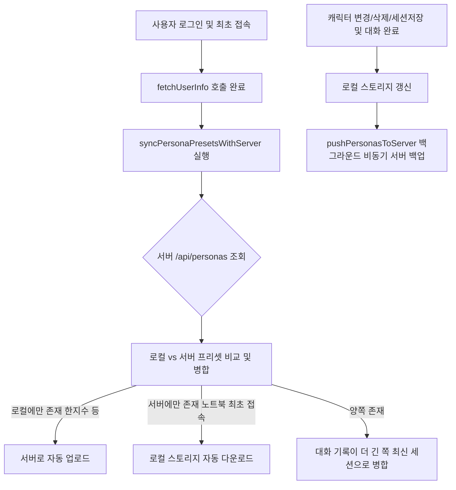

# 🔮 크로니클 AI 스튜디오 페르소나 및 RAG 세션 데이터 서버 동기화 시스템 구축 (2026-06-04)

집 컴퓨터와 노트북 등 서로 다른 작업 기기 간에 가상 인물 설정(페르소나)과 호감도, 대화 기록 및 RAG 임베딩 벡터 데이터가 온전히 유지될 수 있도록 유저별 백엔드 영구 저장 동기화 API를 신설하고 프론트엔드 연동을 완료하였습니다.

---

## 🏗️ 1. 구현 개요

* **목적**: 브라우저 로컬 스토리지(`localStorage`) 보관 방식의 물리적 기기 독립 한계를 극복하고, 멀티 디바이스 환경에서 RAG 세션의 단절 없는 연속성을 보장함.
* **성능 보장**: 데이터 영구 백업 및 동기화 요청을 비동기 백그라운드(Non-blocking) 통신으로 처리하여, 웹 스튜디오의 핵심 대화 렌더링 및 RAG 연산 속도 저하를 0%로 통제함.

---

## 🛠️ 2. 수정 및 생성된 파일 목록

### 1) [server.js](file:///D:/Project/onnamu-project/studio/server.js)
* **변경 내용**:
  * **GET `/api/personas`**: 로그인된 사용자명(`req.user.username`)에 매핑되는 `data/personas_${username}.json` 파일 유무를 확인하고, 존재하면 해당 유저의 모든 캐릭터 프리셋 및 세션 히스토리를 반환합니다. (없을 시 빈 객체 `{}` 반환)
  * **POST `/api/personas`**: 클라이언트가 전송한 프리셋 목록 데이터를 UTF-8(BOM 포함) 인코딩으로 안전하게 파일 시스템에 기록하여 영구 보존합니다.

### 2) [app.js](file:///D:/Project/onnamu-project/studio/app.js)
* **주요 비즈니스 로직 변경**:
  * **`syncPersonaPresetsWithServer()` 신설**: 최초 유저 정보 패치([fetchUserInfo](file:///D:/Project/onnamu-project/studio/app.js#L256)) 직후 서버 데이터와 로컬 스토리지를 양방향 대조하여 병합(Merge)합니다. 누락되거나 더 오래된 대화 기록을 갖고 있는 데이터를 더 긴 대화 세션을 기준으로 최신화하고 로컬 스토리지와 서버를 일치시킵니다.
  * **`pushPersonasToServer()` 신설**: 서버 측에 백그라운드 POST 요청을 전송해 페르소나 정보를 비동기로 저장하는 헬퍼 함수입니다.
  * **실시간 동기화 트리거 연동**:
    * 캐릭터 생성/수정 완료 시 ([saveCurrentPersona](file:///D:/Project/onnamu-project/studio/app.js#L2259)) 서버 백업 트리거.
    * 캐릭터 삭제 완료 시 ([deleteSelectedPersona](file:///D:/Project/onnamu-project/studio/app.js#L2313)) 서버 백업 트리거.
    * 수동 세션 저장 클릭 시 ([saveActiveSession](file:///D:/Project/onnamu-project/studio/app.js#L1151)) 서버 백업 트리거.
    * 매 대화 응답 완료 및 백그라운드 RAG 벡터 생성 직후 ([app.js:L1847](file:///D:/Project/onnamu-project/studio/app.js#L1847)) 서버 백업 트리거.

### 3) [portal/data/news.db](file:///D:/Project/onnamu-project/portal/data/news.db)
* **변경 내용**: 로컬 포털 서비스의 작업 히트맵 연동을 위해 `work_history` 테이블에 오늘 날짜(2026-06-04) 및 '크로니클 AI 스튜디오 페르소나 및 RAG 세션 데이터 서버 동기화 API 구축' 및 '오프라인 폴백 오류 패치 및 경고 알림 신설'에 관한 상세 내역을 성공적으로 주입 완료하였습니다.

---

## 🚀 3. 추가 패치: 오프라인 캐릭터 대사 불일치 버그 해결 및 경고 알림
* **이슈**: API Key 누락으로 오프라인 체험 모드로 시작할 때, 캐릭터 이름은 "서아"로 변경했음에도 대사 지문이나 기억은 하드코딩되어 있던 "릴리스 (계약 악마)"의 텍스트가 강제 출력되어 몰입감을 저해하는 치명적인 버그가 발생했습니다.
* **해결 조치**:
  1. **API Key 누락 경고 안내 추가**: 스튜디오 구동 함수([startStudio](file:///D:/Project/onnamu-project/studio/app.js#L507)) 시작 지점에 API Key 유무를 체크하여 비어 있을 시 체험 모드로 기동된다는 사실을 얼럿창으로 확실히 인지할 수 있게 보완했습니다.
  2. **4종 오프라인 대화 트리 구축**:
     * 릴리스 트리 (`lilithChatTree`), 서아 트리 (`seoaChatTree`), 혜린 트리 (`hyerinChatTree`)를 개별 구축하여 디폴트 3종 캐릭터가 각자의 전용 스토리를 노출하도록 개선했습니다.
     * 범용 커스텀 트리 (`genericChatTree`)를 추가하여 사용자가 새로 정의한 커스텀 캐릭터(예: '한지수')에 대해서도 캐릭터 설정 토큰(`{name}`, `{relation}`, `{desc}`, `{user}`)을 대화 지문 내에 동적으로 치환해 출력하도록 설계하여 릴리스 대사가 노출되는 버그를 원천 해결했습니다.

---

## 🚀 4. 추가 패치: Structured Outputs 도입을 통한 JSON 파싱 에러(크래시) 원천 해결
* **이슈**: 가상 대화 및 소설 모드 진행 시, 구글 Gemini 모델이 간헐적으로 JSON 스키마 규격을 무시하고 임의의 설명 텍스트를 섞어 응답하거나 괄호를 누락시켜 클라이언트 단에서 `SyntaxError` (JSON 파싱 에러)를 뱉으며 세션이 강제 크래시되는 현상이 보고되었습니다.
* **해결 조치**:
  1. **구조화된 출력(Structured Outputs) 스키마 전송 설계**:
     * [app.js](file:///D:/Project/onnamu-project/studio/app.js)의 `fetchGeminiChat` 메서드 내부에 대화 데이터 구조 규격(`chatSchema`)을 선언하고, `fetchGeminiStory` 메서드 내부에 소설 데이터 구조 규격(`storySchema`)을 각각 선언하여 API 호출 시 `responseSchema`라는 이름으로 서버에 바디에 실어 보냅니다.
  2. **서버 측 generationConfig 맵핑**:
     * [server.js](file:///D:/Project/onnamu-project/studio/server.js)의 `/api/generate` 엔드포인트에서 클라이언트가 전달한 `responseSchema`를 감지하여, 구글 API 요청 객체의 `generationConfig.responseSchema` 필드에 동적으로 세팅해 전송합니다.
  3. **결과**: 구글 Gemini API 단에서 스키마 규격을 강제로 만족하는 JSON 데이터만 100% 보장하여 반환하므로, 마크다운 기호 우회나 수동 괄호 파싱 등의 예외 처리 없이도 완벽한 데이터 무결성을 유지하며 크래시 현상을 완전하게 예방했습니다.

---

## 🚀 5. 테스트 및 재검증 권유
수정 및 추가 구현이 완료되어 서버 및 클라이언트 측에 동기화 아키텍처가 결합되었습니다. 
* **확인 권유**:
  1. 집 컴퓨터 브라우저에서 스튜디오 접속 시: 기존의 로컬 '한지수' 캐릭터 데이터가 서버에 신규 등록(JSON 저장)되는지 로그를 검토해 주시기 바랍니다.
  2. 이후 이동식 노트북 브라우저에서 스튜디오 접속 시: 서버에 백업된 데이터가 자동으로 유입되어 캐릭터 리스트에 '한지수'가 나타나며 세션 및 RAG 히스토리가 매끄럽게 복원되는지 검증을 권유해 드립니다.
